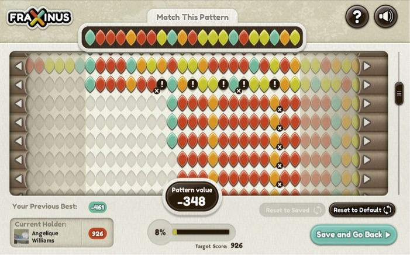
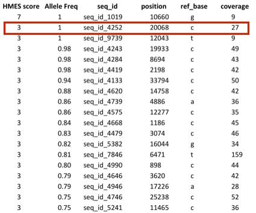

## Fungi, Facebook, Fitness and Flying Machines
##### Dan MacLean
The Sainsbury Laboratory

dan.maclean@tsl.ac.uk @danmaclean

Note: Hello everyone, its a pleasure to be invited to speak to you today. Im very excited to be here to tell you about what me and my group get up to. 

<section data-background="img/thompson_ritchie.jpg">
	

		

			By Peter Hamer - Ken Thompson (sitting) and Dennis Ritchie at PDP-11, Uploaded by Magnus Manske, CC BY-SA 2.0, https://commons.wikimedia.org/w/index.php?curid=24512134
		

	

	<aside class="notes">Note: I am a bioinformatician, which most people in my department think means I do this. They think I spend my days at a computer churning through algorithms and data. Now, no doubt some of you will have noticed these guys in the picture are NOT bioinformaticians at all, they're very much computer scientists. Because bioinformatics is the use of computer science and maths to understand biologically based problems you can get defined very often by what you AREN'T, rather than what you are, depending on who you're talking to. This is particularly amusing when interacting with biologists, a small proportion of whom see what should be a mutually respectful relationship to be more like this...</aside>
	
</section>

What science really thinks of bioinformaticians

Note: I'll let you work out which of these the biologist thinks they are. And when we come to Computer Scientists, they have a much more charitable and collegiate view, there's a lot shared but there are times when they can see bioinformatics, well, if we were all plumbers they see bioinformaticians as the sort of plumber who'd do this 

What science really thinks of bioinformaticians

 

Note:  And quite rightly, often, they ask 'WHY?'. And the answer to that is usually 'Because Biology' because it is messy and dealing with that messiness leads to some non-optimal, or just weird, solutions. The third set of scientists we associate with, though to a lesser extent, is the mathmaticians. And a mathematician who doesn't come across bioinformatics a lot can often get a funny first impression,  they'll often see us a lot like this...

What science really thinks of bioinformaticians

Note: which I admit is fair comment.

### Three Worlds

	M.C Escher, 1955

Note: So bioinformatics is truly interdisciplinary with a massive opportunity to work across  fields and thats what Im going to talk about today. Im going to tell you about a wide range of projects that my group has done that sit across computer science and biology. So this is going to be a hundred mile up sort of view, rather than a detailed look.

<section data-background="img/rust.jpg">
	

		The Sainsbury Laboratory
	

	

		Plant Microbe Interactions
		

			Photo: A. Yaqub/CIMMYT. http://blog.cimmyt.org/?s=Pakistan
		

	

	<aside class="notes"> First, I want to tell you where I work and how that has influenced the research we do.  I work at The Sainsbury Laboratory on the other end of the research park, its a research institute with a particular mission - we all work in one way or another on plant and micro-organism interactions.  In particular we carry out research around plant diseases caused by viruses, bacteria, fungi and similar micro-organisms. And we work at the fundamental molecular biological level, often in model systems like Arabidopsis, the lab rat weed of plant genetics but also in field crop species.  As an institute We're involved in not just understanding what's happening in the plant during diseases but in developing new ways of defeating and resisting disease from the plant side of the equation. A lot of the diseases we work on are crop disease - including the stripe rust on wheat you see here, but also famous diseases like potato blight and others. So underlying what we do in our ivory tower are some very real and very important issues with massive implications for human health and our ability to survive on the planet. And it was with those lofty concerns that the first project Im going to tell you about began. This project quickly turned into just playing computer games and ended up being about sociology! 
	</aside>
	
</section>

###### How to lose friends and alienate people
## With computer games

Note: So Im going to tell you now how we made ourselves feel like the least popular people in the world by creating and releasing a computer game.

<section data-background="img/ash_dieback.jpg">
	

		Ash dieback
	

	

		Hymenoscyphus fraxineus
	

	<aside class="notes"> 
So this took place in the middle of a larger project in which we tried to respond to an outbreak of an invasive plant pathogen in a way that hadn't been done in plant pathology, and not widely in science in general, before.

In 2012 ash dieback, caused by _Hymenoscyphus fraxineus_ was reported in the wild in the UK ...
	</aside>
	
</section>

<section data-background="img/symptoms.jpg">

<aside class="notes"> 
And this is what its effect is - here we have two roadside trees, The left tree is still looking unaffected t whereas the right tree is now severely affected and the disease is  starting to affect the growth and the size of it’s crown. 

Up close you'll see lesions and cankers on stems and branches.

and leaves with brown leaf stalks throughout summer.

and the pathogen makes fruiting bodies on fallen leaf stalks in spring.

And this is a problem not least because ash is an ecologically important species that forms the basis for a lot of biodiversity in our woods and forests, but because over the last couple of decades damage to tree stocks like the Elm and oak have sensitized the British Public and government to tree losses so there was a bit of an outcry and a desire to quickly combat this.
</aside>
</section>

<section data-background="img/lego.jpg">
	

		crowdsourced analyses
	

	

		let the experts at the data
	

<aside class="notes"> 

So we found ourselves able to try and take advantage of new ideas and ways of working that might maximise our speed, and try out some ideas that we need to deal quickly with emergent diseases as informaticians and genomicists. 

To make the most of people and data power, we used a crowd-sourcing approach, where we made whatever data we can generate and can find instantly available, even before it is analysed, (which is quite unusual practice in biology and genomics) and let whoever can help, do what they can.

</aside>
</section>

<section data-background="img/gh.png">
	

		Attribution of contribution
	

	

		git and GitHub as a versioned database
	

<aside class="notes"> 
So we set about putting together the tools and infrastructure to share data rapidly. This would help with ash dieback but we hoped also ulitmately feed back into the issue of food security and maybe have an impact on how we do biology in general too.  And crowdsourcing from scientists did work. We got a wide range of analyses and fast results which was great, but we we didn't stop there.

The data and results themselves are actually hosted externally on github. 

Github is a programmers social coding website. Github is really great at tracking changes to files and keeping records of who made these changes.

The work cycle is really straightforward: you start the day by pulling the latest version of the data from github, 

you make the changes/additions/new data that you think are appropriate and push it back.

Github sits in the middle keeping track of what changes were made and who made them.

That’s the key reason for using github, because its critical that we make proper attribution of contribution. 

If we’re going to get people to give their time and effort for free, we really need to make sure that we’re giving credit for it. 
</aside>
</section>

<section data-background="img/folders.png">
	

		A simple 'folder' database
	

<aside class="notes"> 
This is what is inside the repo itself,

Basically just as directory structure – semantically organized so each dataset and its meta data has a fairly natural place to go. and is really easy for the end user to pick up, and that was another point. Getting biologists involved meant having low barriers to entry, not that it couldn't be complex, just not intimidating or too specialist.
</aside>
</section>

<section data-background="img/circos.png">

<aside class="notes"> 
The analyses went well,

We got a lot of work done through crowdsourcing analyses and are starting to build up quite a good story about our pathogen.

TGAC in Norwich provided us with DNA sequence and a first draft assembly, which the community went on to analyse and annote, and that is what we see here. 

This is a genome picture, showing just a fragment of an annotated genome/ Contigs - the individual  fragments of DNA assembly are arranged around the outside of the circle with gene densities in blue - so we can see the regions of the genome with higher gene density eyc. 

The green inner track is repeat DNA sequences and the two pink tracks are back aligned read coverage and sequence GC content.

We saw from this that the structure of the genome is very interesting, we get these regions where GC content plummets and coverage and repeat sequence shoots up suggesting that the genome is a non typical reduced pathogen genome in which there are many AT-rich, repeat dense islands scattered throughout.

And we got lots more stuff, like the identification of toxin genes, more strain sequence, candidate effector proteins - all sorts of stuff from varied groups

</aside>	
</section>

<section data-background="img/Scientists.jpg">
	

		Reach all the biologists!
	

<aside class="notes">Getting bioinformaticians involved through github is fine. 
But they have a habit of doing bioinformatics analysis and knowing less about the pathogen than they might
We realised that to really add value to our data then the important thing is to bring in biologists,  who know all about the pathogen and host biology to get involved and liberate the genomics data and expertise to them and get the insights back from them.
The first thing we did was the same as every bioinformatician worth their salt,  to put together the basic databases with the right query interface that will help the biologist find what they are looking for from their bit of sequence, their gene or protein function or their named gene and let them start to interrogate the data that was being created.
Crowdsourcing, and in particular wide ranging, comprehensive and hopefully sustainable crowdsourcing is dependent on the community that you can build. So the whole task generalises to one of how you actually build better biology/bioinformatics communities and how you incentivise that. 
</aside>	
</section>

<section data-background="img/Slide17.jpg">
	

		Crowd-Sourcing Genome Browser
	

<aside class="notes">And we’re trying this through new tools and interfaces.

We’ve put together something we’re calling a crowdsourcing genome-browser. Im sure that you’re familiar with the idea of a genome browser. 

Our crowdsourcing browser relates to that in the same way that this guy reading his book relates to these people having a discussion. Our new crowdsourcing browser allows us to take in things like annotations,  and experimental information straight into the repository while providing functionality like BLAST. The info is recorded piecemeal and reflected back to the other users of the tool directly. 
</aside>
</section>

### Gee Fu

Note: We call our tool, Gee Fu and this is the Software stack. Its based on common open source tools, the inimitable WebApollo being the major genome browser style component, GOLLUM is a git based wiki engine, every object, not just features can be annotated through this wiki,  and we also used sequence-server, a ruby gem that implements a BLAST server for sequence based searches. All these are tied together through Gee fu, which is a piece of middleware that acts as an integration layer between other tools

it acts as the dispatch engine for data to the GMOD project web-Apollo genome annotation browser, as a feature linking engine for the wiki and as the sequence store for a BLAST server.

It coordinates automatic exchange and concurrency of data between the apps and the github repo, making sure that contributions from these other tools are tracked into the github repo

It provides a restful interface to the repo data and still acts as a feature and meta data editor in its own right. 

### In-Browser annotation

Note: Its major function is annotation, the tool  provides ways of directly editing and annotating gene models as you browse, and propogates all the edits directly to the data base so all other users can see immediately

### In-Browser analysis

Note: It also allows sequence searches of the provided data too, and fully cross links this back to the annotations and reports Kind of like a “build your own NCBI”, but restricted to a growing set of information for ash dieback

<section data-background="img/Slide21.jpg">

		Reward Badges

<aside class='notes'>When it comes to getting micro-contributions back from individual specialists, then we have a very different problem. First of all, the biggest hurdle is the publish-or-perish imperative through science. As I’ve mentioned, scientists need publications. At the moment, pretty much the only recognised research output is the paper which is why people sit on their results for so long. But open science movements are pressing on and having some effect so there may be opportunities to start valuing much smaller bits of research. 

So we’ve been implementing reward badges into our tool stack.  
</aside>
</section>

### Badge stack

Note: So we added two very specific tools to our stack to manage badge awarding as contributors used the stack. The first of these is Merit, a standalone web app for managing badges themselves. And we also added scoreboard, a tool for tracking the activity of a user within the apps and issuing one of the badges in merit once the achievement has been reached. 

### Badge stack

Note: The user is kept informed of progress by little pop ups as they work, click throughs allow the badge to be collected

<section data-background="img/games.jpg">

		Crowdsourcing from the public with games

<aside class='notes'>But we wanted to take the crowdsourcing a bit further - and given that there was much public interest in the topic we looked at crowdsourcing from members of the public with a general interest in this. 
So we decided to use this crowd to look at the problem of genetic variant calling in the pathogen.
</aside>
</section>

### Variant Calling - SNPs

Note: Bioinformatically, to do this we usually start off with some sort of reference genome, so in our case one particular strain, the KW1 strain of ash dieback and align one by one the short DNA sequence reads from another strain against it. That's what we see here - the top sequence is the reference genome, the rows of commas are reads in which the nucleotides agree with the reference. And we can see clearly the stack of Gs that show the sample has a difference here relative to the reference. Finding Single nucleotide polymorphisms is pretty easy 

### Variant Calling - INDELs

Note: But finding longer insertions and deletions like we see here isn't nearly as easily done, the algorithms we have are heuristics and fail often in the indels that could be most interesting, those in repeat regions, or near the ends of assembly fragments. So this gave us a genuinely useful problem for a human crowd to tackle. 

### Fraxinus: a citizen-science game to tackle ash dieback

Note:  We did this with a game called Fraxinus, it’s a FLASH only facebook game designed by myself and the BAFTA nominated game company Team Cooper in Sheffield. This is the main game screen of Fraxinus. The game contains sequences from an assembly of _H.fraxineus_ and reads from different isolates.

The aim of the game is to do those tricky alignments for us. Refining aligned sequences  manually is something we do all the time, so we had an idea that the game would be fruitful scientifically. So the game provides the tools a player needs to do that.

Along the top we have Target Pattern, from one of our references. Targets are pre-selected to be the sites the algorithms make a mess in. 

The rest of the coloured rows are reads from DNA sequencing experiments. The player can Shift, insert and delete nucleotides to make best alignment. Score for matches, score deducted for mismatches and creating and extending gaps. Once player has maximum score they think they can get, they can claim the pattern for themselves and get points for that. They also get points for improving and replaying puzzles that other players have already played, in fact they get more points for this than doing a new one, so replay and competition is encouraged which we hoped would lead to reanalysis.

We released Fraxinus and started to analyse the results from the puzzles that people were playing and the behaviour of the players.

#### Players converge on the same solutions

Note: The players provided a lot of information, basically the players showed a surprising agreement with each other in the solutions that they provided, these figures show the split of differences between the players and software and the striking thing is that they either agree with the software completely, or they all disagree with the software in the same way. This validates the notion that replay and competition in the game got us better alignments.  

#### Players beat software, especially on INDELs

Note: The players genuinely contributed better results than the software. Here the yellow areas represent the proportion of puzzles the players were better at. On average about 12 percent of the puzzles we uploaded were improved by the players. In the INDELs we uploaded we get improvements of about 30 percent.

And they were better regardless of how we score them, we get the same pattern if we use the identity of sequences or the scoring matrix used in the software.

So the game filled its primary purpose, it helped reliably increase our stock of knowledge about genetic variants in ash dieback which we plugged back into our public databases for use by anyone.

#### OMG! We were soo popular!

Note: And it did this on a large scale, Fraxinus was a very popular game. Part of the strength of Fraxinus was that it got a lot of media attention, thanks mostly to the comms team at TSL. Their efforts pushed us into the pages of several major newspapers and on the TV and as a result we got over 60 000 hits to the game from 137 different countries, which is loads! So it was a big success in those terms and is a significant crowdsourcing project.

#### Players deserted the game

			

				

				

Note: But as time progressed, we found that those headline numbers were masking something much more interesting. Players were leaving the game at an astonishing rate. 

This figure shows the number of visits, sampled each day. Note that this is on a log scale and the decrease is still very visible with a sharp initial part and a long tail. 

On average we lost 95 % of our visitors, each day.

To put this in perspective, if we start off with 10000 on Monday *CLICK*

on Tuesday we have 500 *CLICK* 

and by Wednesday we've just *CLICK* 25 left.   

#### So, we were like...

Note: Now, no one likes losing friends that quickly, not even bioinformaticians! So we weren't impressed. Apparently we'd snatched defeat from the jaws of victory...

#### But thats ok, a 'hardcore' did most work anyway

Note: But it turns out we needn't have worried. Most players contributed very little at all. In this figure, which is players versus cumulative number of alignments, we see about 50 percent of the actual work was done by just 49 of the 60,000 people who ever visited. We picked up a hardcore of players who kept coming back and playing over and over.

#### How much work gets done? 

$$ Work Done = \frac{Human Time - Education Cost}{Task Length} $$

Note: So then our attention turned to the more general question of how many tasks could get done, in any crowdsourcing project? 

It was easy to formulate a general idea of this, its the total time spent divided by the time it takes to do the task, taking count of any time it takes to learn to do the task.

In a specific sense then the total human time can be measured for Fraxinus, its the time spent on the website. 

But the general pattern for a crowdsourcing project is different and the  pattern of visits then is the important thing. So we need to capture that.

#### A power law fits the player data
$$ y = 4074 x^{-0.94} $$

$$ y = ax^k $$

Note: 
And we looked at our and other crowdsourcing projects visit data. We were surprised to see that they follow a remarkably similar pattern to our very lossy one, with that same drastic curve.

So we went ahead and fit the Fraxinus visit data with regression using log-log scales, and we find that it matches up to a power law relationship. And the general form provides a basis for a model for player visit numbers. 

#### A model for the work done 
$$ H = N C_i T_n + \sum N T $$

$$ H = N C_i T_n + \sum N T_n(C_n + C_i d^{\alpha}) + E T_r(C_r + C_i d^{\beta}) $$

Note: and from this basis we 

**click** re-jig the thing to be a sum over times and number of plays

**click** then add in some terms to take account of the relative contributions of returning and new players AND to allow us to represent media events that attract an arbitrary new set of players.

So this gives us a tool with which we can run scenarios relating to human involvement and interest in tasks and work out how much stuff can be done and the sorts of audience we can reach. 

#### Predicting the work and progress from different crowdsourcing strategies 

Note: and this slide shows just that, we see here the models take on the Fraxinus parameters, it replays that scenario very closely.

It also shows that had we not had extra press releases after our initial set we wouldnt have lost very much at all.

We also see that it would have been very hard to make something like this work through a viral strategy. These last four show different friend recruitment regimes, and to get any where near what we saw from the traditional media interest, you need to get on average very silly numbers of friends playing and staying immediately. The red line has players recruiting 10 others immediately and them all staying. So crowdsourcing is all about the release plan, really, purely viral strategies need to be extremely infectious, a better bet is to reach for some sort of bigger name who can help push your activity to a wide audience, this may be traditional media.

* Lots of people play - for a little bit
* A few people stay - forever
* Most of the opportunity for work is at the beginning
* It's a friend-losing game
* Viral doesn't work

Note: So here's what we learned about the game of crowdsourcing... And we think this has some interesting implications, not least for how you set up projects where you want external contributions, but also for interest of the public in things in general. 

## The effect of host jumps on pathogen genomes

Note: Im going to change tack now and move over to a completely different system, Im going to talk briefly about some work we have started on the composition of pathogen genomes as a consequence of changing the host of that pathogen. This is quite early work really and first Im going to try and provide some context of the biological system.

### The Standard Model of Plant Immunity

after Dodds and Rathjen (2010) Nat Rev Genet. 11:539-48

Note: So this is the standard model of plant immunity. In it we see a plant cell and two levels of immunity. The first is the PTI response, this is where receptors on the cell detect the presence of pathogen markers or molecules and trigger things like a hypersensitive cell death response. The second and the much more complex and long lasting is the ETI or effector triggered immune response. In this the infecting pathogen somehow breaks through into the cell and secretes proteins called effectors. These effectors can be detected by specific receptors so-called NB-LRR or Nibler resistance proteins that turn on the ETI response. If the effector isn't detected then we get an infection. 

So the thing to note is that the Niblers evolve to detect specific effectors, if a pathogen lands on a plant without the right Niblers then there is going to be an infection. So there is a pretty strong (but not complete) one nibler one effector relationship. And the repertoire of effectors that you get is really important in defining what your host is.

And effectors aren't neccesarily related to each other in the same host. They're much more of a workers union than a gene family. The proteins carry out a wide range of functions and interrupt the plant cell all over the place. 
So theres a lot of evolutionary pressure on these proteins.

#### A two-speed genome

Dong et al (2015) Curr Opin Genet Dev. 35:57-65

Note: And it appears that this evolutionary pressure is causing structural changes in the pathogen genome, so here we see heatmaps of gene density in two pathogen genomes. The x axis has the nucleotide distance between genes in the upstream direction and the y axis the distance between genes in the downstream direction. What we see is the majority of genes have average sort of intergenic spacers. The red blobs in the top corner are the effectors and these are in very gene sparse regions. As well as this these are the genes under positive selection and in the case of the Phytophthora infestans on the right theres a lot of genes out there. So Sophien Kamoun's group at TSL developed a hypothesis they call the two-speed genome, a genome with a core of regular genes evolving the way irregular genes do, but also with a set of effector genes wrapped in repeats and transposable elements that are highly involved in the infection process.   

#### Genomes are expanded in some filamentous plant pathogens

Raffaele and Kamoun (2012) Nat Rev Microbiol. 10:417-30. doi: 10.1038/nrmicro2790.

Note: It's also been observed that the genomes of several lineages of filamentous plant pathogens, these ones with the bigger blue blobs here,  have repeat-rich genomes, again with these regions being effector rich and highly polymorphic, suggesting they also may be undergoing particular selection. 

These organisms seem to be the ones that are the most nasty, the ones able to adapt quickest and shift hosts best. So it was hypothesised by Sophien Kamoun and Sylviane Raffaele at TSL that the two speed expanded genome is an important factor in the ability of a plant pathogen to evolve around changes in the host plant.

I thought this was fabulously interesting and became intrigued by  the mechanics of this phenomenon. In particular we're interested in what effect a change of hosts can have on a pathogen genome.  We can't run lab or field experiments on this so our better alternative is to use models to help us lay out our thoughts and work through scenarios that might have been.  

#### A kinetic model for gene gain and loss

$$ (EG, TE) $$

$$ \text{Fitness } U_g = \mathcal{F} \left(s_1, s_2, \dots, s_n \right) $$
$$ \mathcal{F} = \frac{ \sum{s_i}}{Threshold + \sum{s_i} } $$

Note: So we built a kinetic model to study this. The main entities in the model are the effectors, and Transposable elements (or TEs), which are proxies for the repeats that seperate the effectors in the genomes.

The model is concerned basically with following trajectories in the Effector and TE configuration space. Each point in the space is defined by sets of effectors and TEs and transitioning from one point to another is done through this kinetic scheme according to defined transition probabilities. The Effectors can basically duplicate, become silenced, degrade or get deleted. Theres also possibility for Horizontal gene transfer as well

The Effectors are characterised by a score that quantifies how beneficial to the pathogen the effector is and the configuration state that quantifies how effective the overall effector set is with respect to a host. This is weighted by a threshold for fitness.

#### Fitness decreases after stabilisation
 

Note: So in running the model, at first without any sort of host jump, so on the same host throughout - we see an initial increase in the number of effectors as time goes on, the red line in the left panel and then a stabilisation, but we also see a general decrease in the fitness score. The middle panel is the fitness score for a realistic mutation rate. The panel on the right is the fitness for a mutation rate a hundred times larger.

So we have a situation where not jumping can result in an increase in effector numbers, but a stagnation in fitness and we need a really high mutation rate to stay fit. Increasing effector numbers could potentially counteract this tendency.

#### Rapid jumps increase rate of effector accumulation

Note: When we start to plug in host jumps, then we see that frequency of the jump can have an effect on the effector accumulation. These lines indicate effector numbers over time for different jump frequency. And we see that the two most rapid rates of jumps result in an increased early accumulation of effectors.  

#### Jumps reduce effector count
 

Note:  But the picture is slightly different in the longer term.  The total number of effectors is lower in the simulations with the jumps than in those with no jumps (the red line). 

#### Jump distance has no effect on dynamics 

Note: We also had a parameter C which was the probability an effector got lost in the jump and still had a role. This effectively allowed us to manipulate the distance of the jump and mimic jumping to more less phylogenetically distant hosts.  The jump distance didn't have any effect on the dynamics of effector accumulation. The figure here is one realisation in one rate of jumping but we saw the same pattern for all that we looked at.

#### Jump Quickly - or Never!

Note: So we have a picture emerging in which effector diversification is split into two options: If a pathogen can jump quickly then they gain a rapid increase in the number of effectors in the tool kit and remain a very competitive and adaptable pathogen. Conversely if a pathogen can stick with a host they remain uncompetitive initially, so not being able to jump is initially a weakness but later there is an adaptation and increase in effectors that a rapid jumper cant match. And there appears to be a one or the other strategy, there's no benefit from jumping just a bit less regularly and no real continuum or pay off for that strategy. Which is interesting as it implies a two speed jump strategy in parallel to our two speed genome.

We've really just scratched the surface of this system. Effectors are one of the key systems in plant microbe interactions and I really believe that studying them, the dynamics they have with the cognate nibbler and resistance genes and the interplay and effects they have on the host as a cohort will lead to some world changing stuff. Simply because this is the system that determines whether plant disease happens when a plant and a microbe meet and we know next to nothing about how it works on the system level and know zero about how to manipulate it properly. We need these computational and mathematical approaches to do this comprehensively, and I'll be pushing this project on hopefully soon. 
 
In contrast to these simulations and theoretical concerns, The Sainsbury Lab does an awful lot of applied stuff for immediate impact and application in the real world, and naturally the resistance of disease with Nibblers is one aspect of that. So I'd like to speak about how our genomics and bioinformatics has contributed to some of that

<section data-background="img/JJ_spuds.jpg">
	

		Engineering disease resistance
	

<aside class="notes"> To finish, I'd like to talk about some genomics stuff. Earlier, I showed you the standard model of plant immunity and I highlighted the importance of the Nibbler genes in identifying effectors and triggering the immune response. This close relationship means that Nibblers are excellent targets for cloning and transferring via genetic modification to create resistance in susceptible varieties. This is something that has been aggressively and fruitfully chased in The Sainsbury Lab - this is a picture of my colleague, Jonathan Jones - a geneticist and molecular biologist who recently identified Potato Late Blight resistance genes in a wild South American potato, that little one on the right and cloned and transferred them to the Supermarket variety Desiree on the left.
</aside>
</section>

<section data-background="img/blighted_crop.jpg">
	

		Engineering disease resistance
	

<aside class="notes"> So this is a test planting of the potatoes he produced, the regular Desiree are on the right and the GM on the left. These potatoes were simply planted and left out in the field. Potato blight is endemic in the UK and the susceptible plants simply died - they weren't deliberately innoculated. It needs a lot of crop spraying and pesticide to keep regular potato crops alive and the GM approach has a lot of potential. The problem is the time and cost it takes to produce these plants, not least the genetics and genomics required to identify the resistance genes themselves, which is the bigger part of it.   

Genomics is powerful, and we can generate DNA sequence really ridiculously easily, we can sample a genome many times over in small fragments overnight and for a few hundred quid, but it still takes a long time and a lot of money to generate a useable genome sequence and more importantly a good, reliable map of where and what the genes are. Hence doing something like this is really bottlenecked. 
</aside>
</section>

#### Reference Free SNP detection

Note: So we started to look at methods for doing the same thing, straight from the short fragments of DNA sequence that come straight off the machine. Identifying SNPs without a reference. To do this we took advantage of some of the data structures that had started to be used in sequence assemblers. 

Next generation assemblers are built around the idea of de Bruijn graphs - directed graphs representing 1 character overlaps between sequences of symbols from an alphabet, in this case A,C,G and T. The sequences being all the same length, K and called k-mers. The idea being that the path through the graph which ideally goes through every node and edge once is the right genome assembly.

Obviously genomes are much messier than this but the data structure is useful - we build the graph by smashing all the DNA reads from the sequencer into kmers and making them nodes in the graph with edges representing the overlaps and keeping track of the number of times we see each kmer. The paths extend naturally when kmers from other reads overlap existing nodes.

 

Note: And what you see when small differences appear in the sequence is a bubble in the graph of length k with the SNP at the bifurcation in the sequence. So we can search the graph for these structures and find a SNP with trailing sequence either side.

Note: We can elaborate by adding a further attribute to our graph - colour is a favourite one - such that we can differentiate the sample from which the kmer came and identify SNPs between different samples as a bubble with one path in one colour and the other path in another. And this gives us a SNP between two or more different samples in its original genomic context without first assembling the genome. Which is a very useful thing.

Note: And we can go further and identify many types of interesting SNPs that come out of all sorts of interesting genetic crosses by the pattern of colours on paths. So this top one has a path with 2 colours and another with one colour indicating one sample had both variants so was likely heterozygous for the SNP.

The second one here is heterozygous in both samples and the third one is a bit wacky with two alleles in each and a third only in the blue.

So the data representation is compact and useful - the only problem now is - how to implement it in a computer and get the information out.

Note: So we didn't build our own De Bruijn graph assembler - we used an existing open source one called Cortex, developed by TGAC in Norwich and Zamin Iqbal now at the Wellcome Trust Centre of Human Genetics in Oxford. And on this we built a brute force bubble lister to find and output as many bubbles of a specified type as we could. Simply we started with points of divergence in the graph - nodes with outdegree 2 or more and did depth-first search until we hit a maximum depth - if we found any convergence in the paths downstream - we listed an end point and filled in the path we'd traced for a candidate bubble.

Note: To test this out we used lists of SNPs in different ecotypes of Arabidopsis as ground truth and compared against those. As you might imagine we found some strong sensitivity to the depth parameter - the greater the depth the greater the number of bubbles.

 

Note: But saw that the proportion of those bubbles that were real SNPs went down - the rows are the depth parameter change and the dotted lines are the proportion of SNPs in the total number of bubbles - basically false positives went up. 

Note: We elaborated the scheme a little further and implemented a ranking heuristic - this took into account the equality of path length and metrics on the believability of the DNA sequence sampled and found that this really tightened things up. In our top ten thousand or so bubbles we were getting accurate SNP predictions of around 90 percent, which is a very useful number of SNPs and markers to be getting along with

#### 2k+2 - a bubble oriented algorithm

Note: So we took a step back and realised we were just being hacky, which is a bioinformaticians habit. Instead of the depth first approach we specified our SNPs much more clearly, as 2k plus 2 cycles - strictly hamiltonian and eulerian cycles I think - and tested this approach. 

We got great accuracy off the bat, usually about 85% of predicted SNPs were real in most of 16 ARabidopsis ecotypes that we tested and a much larger number of SNPs was returned, around sixty thousand which was about half of the total list of real SNPs. 

Note: We also found that the 2k+2 algorithm was capable at finding SNPs in the complex portions of the graph that we think were causing problems for the depth first method. So we sampled subgraphs - around thirty thousand in three arabidopsis ecotypes - we can see the number of branching nodes in each subgraph here in the top panel and we were able to see the algorithm recall real SNPs in subgraphs with many branch nodes. The Heatmap on the bottom panel shows a log scale of counts of the number of subgraphs with x branching nodes and y SNPs found. So we had an algorithm that could find difficult trait-linked SNPs directly from the graph structure and needing only DNA sequence reads. This approach takes months off the timescale of finding candidate SNPs and markers for the sort of molecular cloning study we do. So its a very valuable tool of itself. Crucially though it opens up the variety of species we can work with, so instead of having to wait for a genome consortium to build and annotate a gold standard genome we can get stuck in with sequence data almost straight from the field. So looking back to our potato plant problem we can go out to South America, where the potato originated and there are still many wild relatives that are completely resistant to potato blight, sequence some of those relatives and get the trait-linked SNPs that might be causing resistance - along with the local genomic context and then go on to use that information to guide searches in the potato itself.

###### Finding causative mutations in genetic screens
## Without a reference genome

Note: So, from that base, we took the next step and tried to go from identifying and classifiying SNPs to identifying the one that actually causes the physical difference, again with the minimum of genomics resources. Ideally this would find application in situations like genetic screens in the lab, so we have tighter control over the actual genetics of the situation.  Though by the time we'd got here DNA sequencing had moved on, and we had access to much larger genome fragments from sequencers, so we can work on fragments of around 3 kilobases initially.

#### SNP frequency peaks around causative mutation after crosses

Note:  We take advantage of the fact that in forward genetic screens, when we do mutagenesis we introduce SNPs at a uniform rate across the genome. One of those is the one that causes our selected phenotype, marked here in the yellow line.  Subsequent crosses with a wild type line mix in the DNA from the new line but by selecting for a specific trait constantly we can  fix the causative mutation in the population but the crossing also has the effect of reducing the mutagenesis induced SNPs further away from the bit were selecting for in the screen, so we get a fading out of those homozygous SNPs from the mutagenesis across the genome, while the SNPs that come from natural variation remain relatively uniform, which we can see in the right of the pictures. 

We can use these two pieces of information to reconstruct the order of contigs or reads from unassembled genomes.

####  Reconstituting the order of contigs

Note: When we have a draft assembly of contigs or just reads, then the random order means that the distribution is smoothed out. We can put the peak back by reordering the contigs properly and we initially did this with genetic algorithms to explore permutations and select the most appropriate. This picture shows a version looking for the optimum blue line and improving the permutations at each iteration.

However, this sort of approach failed on real sized genomes, mostly because there were too many fragment permutations to explore in a sensible time. 

#### CHERI-PIC - A rapid sort of fragments

$$ HMES = \frac{homozygous}{heterozygous} $$

Note: To gain speed this we developed a pre-filtering and sorting algorithm that can reconstruct the shape and approximate order of contigs or reads prior to any finishing that might be needed.

Its called CHERI-PIC, after a somewhat contrived acronym, and it works by first placing all the fragments into ascending order of the ratio of homozygous to heterozygous SNPs, so that we have a frequency plot that ideally looks like thiss

#### Phase 1 - A rapid sort of fragments

Note: Then CHERI-PIC works its way up that list, assigning the fragments to the far ends of another list in turn, building up toward the middle so that the original shape can be rebuilt. The fragments closest to the centre then become the ones most likely to be those with the mutation we are looking for. 

#### CHERI-PIC effectively reorganises contigs

(Allen et al 2013)

Note: So we carried out a series of tests, from previous crosses in the literature with positively identified causative mutations. These were in organsisms with well sequenced genomes so we were able to computationally smash up the genome sequence into fragments similar to those we see in real sequencing experiments and compare the order from our process to the real one. And we found in a wide range of experiments and crosses, including in Rice and Arabidopsis, like this one here, and in out- and back-crosses that we did a great job of putting back together the order and from there ... (cont next slide)

### CHERI-PIC ranks causative mutations highly

Note: We found that CHERI-PIC put the causative mutation consistently in the top five most likely SNPs, out of tens of thousands. So its a good system with which we can go quickly, that is in a couple of hours, from the raw sequence data to the likely causative SNP, which is a saving of a year or two of work over current methods. 

<section data-background="img/copter.jpg">
	

		Open hardware solutions for lab and field
	

<aside class="notes"> 
We've been working on combining low cost consumer level computers, specifically Raspberry Pi's and the range of tiny camera units that are availabe with an eye on helping our plant disease interaction research. Sometimes this is for lab based stuff, so in controlled growth rooms but also we are trying to push this into the research field plots that we have. And this means having some sort of mobile platform, For us this is consumer quadcopters and GPS systems that we can hack. You can see here a quadcopter from a kit, a 3D Robotics Quad kit - to be precise, which costs about £500. It carries GPS modules, telemetry and here on the front we’ve stuck a Raspberry Pi. The Quad is autonomous, there's laptop software so that you can program the onboard GPS with a flightplan and just let it off. Alternatively you can fly it with a remote.  

And the GPS unit can talk directly to the Pi. So the copter can reach a way point and send a signal to the Pi that its time to perform an operation, like taking a picture or a reading or something. So for about £700 or so you can build custom extensible drone solutions that you can tailor to your needs.  And that is the basis of a hackable open source remote sensing platform. 

</aside>
</section>

<section data-background="img/IR.jpg">

<aside class="notes"> 
	
So the hook for plant health is that pretty much any digital camera is a light sensor array that works in multiple spectra of light including Infrared. The sensor of a digital camera by itself  can read infrared, though most manufacturers stick in a layer of plastic that deliberately filters infrared out.
And this is really useful for measuring plant health because of a quirk of how healthy plants absorb visible light and even generate some infrared. 
when the plant is growing well and photosynthesis is going well there is a large absorption of the visible parts of the spectrum. With infrared left over. 
Basically we see a green plant because the blue and red – and in fact most of the green is absorbed by photosynthetic light capturing apparatus – the photosystems, and what is reflected is mostly green. And almost all the infrared comes back too– though we can’t see that. The amount of infrared that bounces back is also increased when the plant is in high light or doing really well. The plant often cant use all the red green and blue light energy the photosystems have already converted, so photosynthesis has a kind of overflow that lets that energy go as heat and thermal infrared light.
So all this boils down to is that light reflected from a healthy plant has a greater proportion of infrared than that from an unhealthy plant and that’s a difference we can take advantage of
</aside>
</section>

### Healthy plant tissue show up brightest in IR images

Note: This lovely scene here pictured in visible light on the right has been taken in infrared and the image data put through a per channel transformation called NDVI on the left.   As you can see in this picture any non leafy bits show up dead dark, while healthy active bits are bright

And the focus of my groups work is to develop the tools and pipelines for image analysis that will enhance the work that can be done in the field and the lab. Including for plant and crop health and things like genetic screens.

### Whole/sub-field status

Note: so as an example we've been taking images of wheat lines like this one and using those image methods to quantify photosynthetic capacity well enough to compare within plots. In this image the wheat lines are planted in vertical lines, so we can look at the infrared coming off certain sections of the image corresponding to the lines and make plots like this of infrared enrichment. So in the graph on the right we can see that the plants in the left and centre of the picture have a strong infrared component – the strong blue and green peaks, whereas the plants in the right of the picture shown by the red peak in the graph are reflecting less infrared, so have a weaker peak. 

### Leaf infection level quantification

Note: And also we're getting down to the leaf level. This is an in-lab proof of principle shot measuring disease progression in some infected potato leaves. The red bits are the uninfected tissues and the yellow bit and blue bits are dead or dying off – and we hope that we’ll be able to bring together disease lesion detection for monitoring existence and progression of disease in research labs.  But there’s also potential in this sort of thing as a disease detector in the field, Consider having the drone and Raspberry Pi combination I’ve shown take off each afternoon and scan a field and highlighting potential disease lesions on crops – then simply emailing you the pictures for a human verification. That sort of thing is doable right now.  The overall aim with this project in my group is to try and bring the open source image analysis and hardware options together and develop them into workable open source solutions for common agricultural and research applications. We believe a lot can be accomplished with a little, particularly if you have some niche or developmental requirments.

And that is all I wanted to say.

<section class="starwars">

<h2 style="text-align:center;">Acknowledgements</h2>
<h3 style="text-align:center;">Open Ash Dieback and Fraxinus</h3>

Shyam Rallapalli

Team Cooper (Sheffield)

Allan Downie and Anne Edwards (JIC)

Sophien Kamoun, Diane Saunders, Kentaro Yoshida and KamounLab (TSL)

The Genome Analysis Centre

The Fraxinus Players

<h3 style="text-align:center;">Theoretical Genomics</h3>

Carlos Lugo

Alice Minotto

Sophien Kamoun (TSL)

<h3 style="text-align:center;">Mutation Hunters</h3>

Richard Leggett

Reda Younsi

Pilar Corredor Moreno

Ed Chalstrey

Shyam Rallapalli

Jonathan Jones, Eric Ward, Cintia Kawashima, Walter Verweij and Jones Lab (TSL)

<h3 style="text-align:center;">Drones and Open Pi Image</h3>

Martin Page

Alex Webb (University of Cambridge)

Ksenia Krasileva (TGAC)

Cristobal Uauy (JIC)

Phillipa Borrill (JIC)

<h3 style="text-align:center;">Funding</h3>

</section>